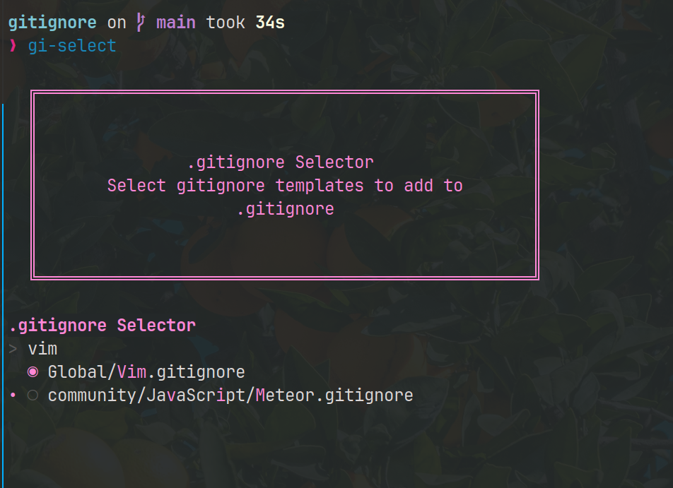

# scripts
Scripts to help automate small tasks

## Table of Contents
- [audiobook-pipeline.sh](#audiobook-pipelinesh)
- [audiobook-split.sh](#audiobook-splitsh)
- [audible-download.sh](#audible-downloadsh)
- [gi-select.sh](#gi-selectsh)

## `audiobook-pipeline.sh`

Complete audiobook processing pipeline: Download → Convert → Split to MP3s for OpenSwim with interactive selection.

**Requirements:**
- `uvx` for running audible-cli
- `audible-cli` (automatically installed via uvx)
- `ffmpeg` (version 4.4+ for AAXC support)
- `gum` for interactive selection
- `audiobook-split.sh` (should be in same directory)

**Features:**
- **Complete pipeline** - Download, convert, and split in one command
- **Interactive selection** - Use gum to choose specific audiobooks from your library
- **Format conversion** - AAX/AAXC to M4B to MP3 with activation bytes
- **Organized output** - Creates individual folders for each book in OpenSwim directory
- **Progress tracking** - Real-time progress for each pipeline step
- **Dry-run mode** - Preview what would be processed without doing it
- **Intermediate file management** - Option to keep or clean up temporary files
- **Error handling** - Robust error handling with detailed logging
- **Profile support** - Use different Audible accounts/profiles

**Pipeline Steps:**
1. **Retrieve activation bytes** - Automatically get activation bytes from audible-cli
2. **Library listing** - Fetch your complete Audible library
3. **Interactive selection** - Choose one or more audiobooks with gum
4. **Download** - Download selected audiobooks in AAX/AAXC format
5. **Convert** - Convert to M4B format using ffmpeg and activation bytes
6. **Split** - Split into individual MP3 files using audiobook-split.sh
7. **Organize** - Place files in ~/Audiobooks/OpenSwim/BookTitle/ structure

**Setup:**
Before using this script, authenticate with Audible:
```bash
uvx --from audible-cli audible quickstart
```

**Usage:**
```bash
./audiobook-pipeline.sh [OPTIONS]
./audiobook-pipeline.sh -h  # Show help
```

**Options:**
- `-p, --profile PROFILE` - Audible profile to use
- `-a, --activation-bytes BYTES` - Activation bytes (auto-retrieved if not provided)
- `-d, --duration SECONDS` - Segment duration in seconds (default: 300 = 5 minutes)
- `-o, --output-dir DIR` - Output directory (default: ~/Audiobooks/OpenSwim)
- `-t, --temp-dir DIR` - Temporary download directory (default: ~/Audiobooks/audible)
- `-k, --keep-intermediate` - Keep intermediate files (M4B, AAX)
- `-n, --dry-run` - Show what would be processed without doing it

**Examples:**
```bash
./audiobook-pipeline.sh                        # Full interactive pipeline
./audiobook-pipeline.sh --profile work         # Use specific profile
./audiobook-pipeline.sh --duration 480         # 8-minute segments
./audiobook-pipeline.sh --keep-intermediate    # Keep downloaded files
./audiobook-pipeline.sh --dry-run             # Preview what would happen
```

**Directory Structure:**
```
~/Audiobooks/audible/          (temporary downloads)
~/Audiobooks/OpenSwim/         (final MP3 files)
└── BookTitle/                 (one folder per book)
    ├── booktitle_01.mp3
    ├── booktitle_02.mp3
    └── ...
```

## `audiobook-split.sh`

Split audiobooks into smaller segments for easier listening or processing using ffmpeg's efficient segment muxer.

**Requirements:**
- `ffmpeg` for audio processing
- `gum` for prettier terminal output

**Features:**
- **Efficient processing** - Uses ffmpeg's built-in segment muxer (low memory usage)
- **Real-time progress** - Shows percentage, elapsed time, and ETA with fallback for older gum versions
- **Intelligent performance** - Auto-detects CPU architecture and optimizes thread count accordingly
- **FAT32-compatible filenames** - Lowercase, no special characters, shorter paths
- **Dynamic numbering** - Uses minimum digits needed (2-4 digits based on segment count)
- **Human-friendly indexing** - Starts from 1 instead of 0
- **Custom output directory** - Specify where files are saved, uses directory name as file prefix
- **Multiple formats** - Supports m4a, m4b, and mp3 input
- **Comprehensive analysis** - Post-processing summary with file statistics and anomaly detection

**Usage:**
```bash
./audiobook-split.sh <audiobook_file> [segment_duration_in_seconds] [options]
./audiobook-split.sh -h  # Show help
```

**Options:**
- `-O, --output-dir DIR` - Custom output directory
- `-h, --help` - Show help message

**Supported formats:** m4a, m4b, mp3  
**Default segment duration:** 5 minutes (300 seconds)

**Examples:**
```bash
./audiobook-split.sh audiobook.m4a                    # Split into 5-minute segments
./audiobook-split.sh audiobook.m4b 600                # Split into 10-minute segments  
./audiobook-split.sh audiobook.mp3 480 -O harry_potter # Custom output directory
```

**Output:**
- Files saved as `{prefix}_01.mp3`, `{prefix}_02.mp3`, etc. (dynamic digit count)
- FAT32-compatible filenames (lowercase, underscores replace special chars)
- Custom directory: Uses directory name as prefix (e.g., `harry_potter_01.mp3`)
- Progress display: `🔄 45% (02:15 / 17:18:34) | Elapsed: 01:30 | ETA: 02:15`
- Performance info: `⚡ Performance: Using 16/32 threads (AMD Ryzen 9 7950X) | RAM: 64G`
- Post-processing analysis with file statistics and outlier detection

## `audible-download.sh`

Download audiobooks from Audible using audible-cli with comprehensive configuration options.

**Requirements:**
- `uvx` for running audible-cli
- `audible-cli` (installed via uvx)
- `gum` for prettier terminal output (optional)

**Features:**
- **Multiple download formats** - AAXC, AAX, and PDF support
- **Flexible filtering** - Download by date range or all audiobooks
- **Profile support** - Use different Audible accounts/profiles
- **Dry-run mode** - Preview what would be downloaded without downloading
- **Custom output directory** - Specify download location (default: ~/Audiobooks/audible)
- **Progress tracking** - Real-time download progress with verbose levels
- **Input validation** - Validates dates, formats, and dependencies
- **Enhanced UI** - Styled output with gum integration

**Setup:**
Before using this script, authenticate with Audible:
```bash
uvx --from audible-cli audible quickstart
```

**Usage:**
```bash
./audible-download.sh [OPTIONS]
./audible-download.sh -h  # Show help
```

**Options:**
- `-d, --download-dir DIR` - Download directory (default: ~/Audiobooks/audible)
- `-p, --profile PROFILE` - Audible profile to use
- `-f, --format FORMAT` - Download format: aaxc, aax, pdf (default: aaxc)
- `-a, --all` - Download all audiobooks from library
- `-s, --start-date DATE` - Download books added after this date (YYYY-MM-DD)
- `-e, --end-date DATE` - Download books added before this date (YYYY-MM-DD)
- `-v, --verbose LEVEL` - Verbose level: debug, info, warning, error (default: info)
- `-n, --dry-run` - Show what would be downloaded without downloading

**Examples:**
```bash
./audible-download.sh --all                              # Download all audiobooks
./audible-download.sh --all --format aax                 # Download all as AAX format
./audible-download.sh --start-date "2023-01-01" --all    # Download books added after Jan 1, 2023
./audible-download.sh --profile work --all               # Use specific profile
./audible-download.sh --dry-run --all                    # Preview what would be downloaded
```

## `gi-select.sh`

This script helps create a `.gitignore` from `github.com/github/gitignore`'s 
list of files.

First, clone the repo to `~/code/tools/gitignore`, then install `gum`.

Link this file as `gi-select` for convenience


